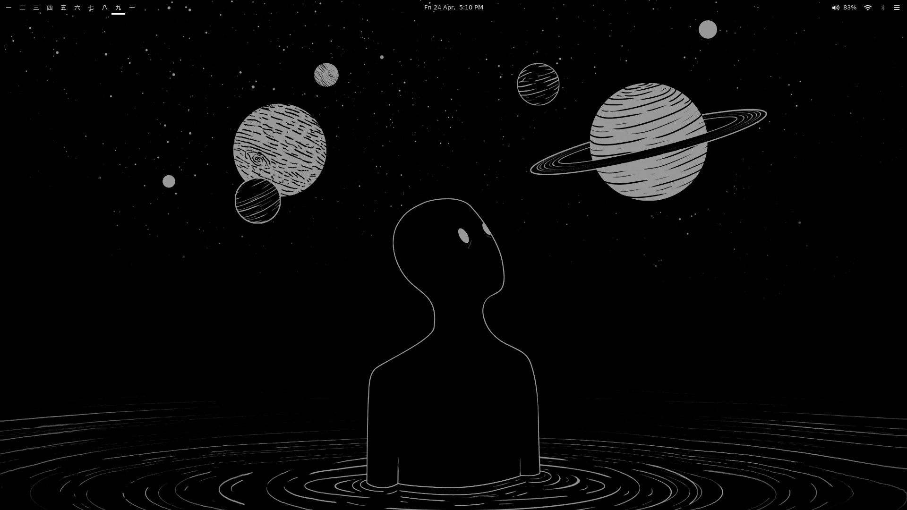
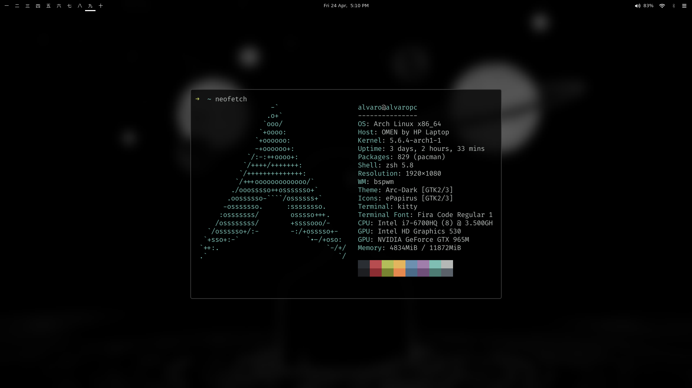
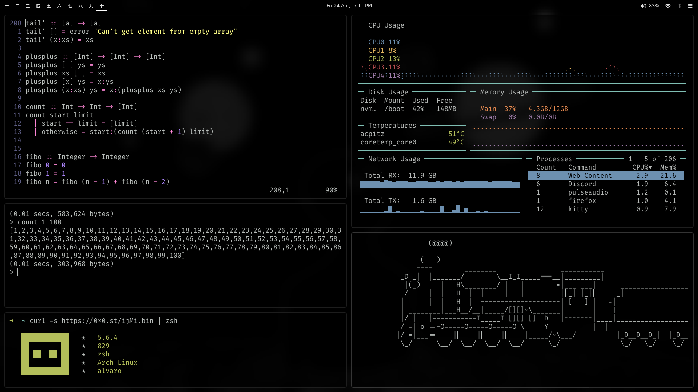

<!-- Introducction -->
# dotfiles
This repo contains all the relevant dotfiles, scripts and configs
present in my bspwm rice.<br/>

Everything will be briefly explained in this README including
dependencies and other assets.<br/><br/>

<!-- Contents -->
## Content
- [Cloning this repo](#cloning-this-repo-experimental)

- [Dependencies](#dependencies)
  - bspwm
    - Wallpaper
    - xorg utilities
    - Other

  - Polybar
    - Fonts
    - Rofi statusbar
    - Network statusbar
    - Bluetooth statusbar

- [Preview](#preview)

<!-- Cloning -->
## Cloning this repo (experimental)

The folowing steps were based of
[this article](https://www.atlassian.com/git/tutorials/dotfiles)
consider giving it a read if you also want to create a bare repository 
to store your dotfiles.

To clone this entire repository and import **everything** do the following
steps: <br/>

First create a source repo directory:

```
mkdir .dotconfig
```

And add it to a *.gitignore* file to avoid weird recursion problems:

```
echo ".dotconfig" >> .gitignore
```

Now clone your dotfiles into a bare repository in a "dot" folder of your $HOME:

```
git clone --bare https://github.com/Alvaro-A/dotfiles.git $HOME/.config
```

Checkout the actual content from the bare repository in your $HOME:

```
/usr/bin/git --git-dir=$HOME/.dotconfig/ --work-tree=$HOME checkout
```

The step above might fail with a message like:

```
error: The following untracked working tree files would be overwritten by checkout:
  .various dotfiles
Please move or remove them before you can switch branches.
Aborting
```

This is because your $HOME folder might already have some stock configuration files which
would be overwritten by Git. The solution is simple: back up the files if you care about
them, remove them if you don't care.

Re-run the check out if you had problems:

```
/usr/bin/git --git-dir=$HOME/.dotconfig/ --work-tree=$HOME checkout
```

<!-- Dependencies -->
## Dependencies
A brief summary of everything you need for everything to work, installation 
method and package names may vary by the distro you're using.

### bspwm:
#### Wallpaper
- feh
- wmctrl
- graphicsmagick
- [this script](https://github.com/rstacruz/feh-blur-wallpaper)
to blur the background
- [this other script](https://github.com/rstacruz/feh-blur-wallpaper)
for a cool lockscreen<br/>

Both scripts are in `.config/scripts` inside this repo, but shoutouts to
those people flor their amazing work. They may also have additional
installation steps so be sure to check them out

#### xorg utilities
- xorg-xev
- xorg-xinput
- xorg-xrandr
- xorg-xsetroot

#### Other
- rofi
- nemo
- sxhkd
- flameshot
- [this picom fork](https://github.com/ibhagwan/picom)

### Polybar:
#### Fonts
- otf-ipafont
- otf-fira-code
- ttf-font-awesome

#### Rofi statusbar
- rofi

#### Network Statusbar
- networkmanager

#### Bluetooth statusbar
Cloned from [this repo](https://github.com/msaitz/polybar-bluetooth)
- blueberry

<!-- Preview -->
## Preview





